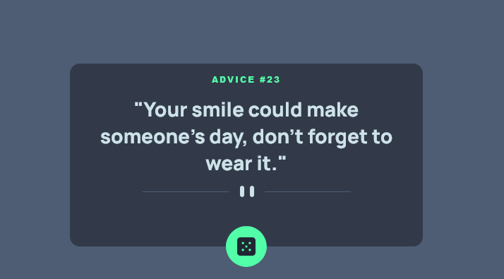

# Frontend Mentor - Advice generator app solution

This is a solution to the [Advice generator app challenge on Frontend Mentor](https://www.frontendmentor.io/challenges/advice-generator-app-QdUG-13db). Frontend Mentor challenges help you improve your coding skills by building realistic projects.

## Table of contents

- [Frontend Mentor - Advice generator app solution](#frontend-mentor---advice-generator-app-solution)
  - [Table of contents](#table-of-contents)
  - [Overview](#overview)
    - [The challenge](#the-challenge)
    - [Screenshot](#screenshot)
    - [Links](#links)
  - [My process](#my-process)
    - [Built with](#built-with)
    - [What I learned](#what-i-learned)
  - [Author](#author)

## Overview

### The challenge

Users should be able to:

- see different advice on load page and also when he click the dice icon

### Screenshot



### Links

- [Code Source]()
- [Live Demo]()

## My process

### Built with

- Mobile-first workflow
- [React](https://reactjs.org/) - JS library
- [SASS](https://sass-lang.com//) - CSS preprocessor

### What I learned

This API was little tricky because any time you want to get an advice you have to put the id number with you own, so I create function to return random number between 1 and 224 because is the max advice.
check out this snippet:

```js
function generateRandomID() {
  return Math.floor(Math.random() * 244) + 1;
}

fetch(`https://api.adviceslip.com/advice/${generateRandomID()}`)
        .then((req) => req.json())
        .then((data) => {
          try {
            setQuote(data.slip);
          } catch (err) {}
```

## Author

- Frontend Mentor - [@zougari47](https://www.frontendmentor.io/profile/zougari47)
- Twitter - [@zougari47](https://www.twitter.com/zougari47)
- codepen - [@zougari47](https://codepen.io/zougari47)
